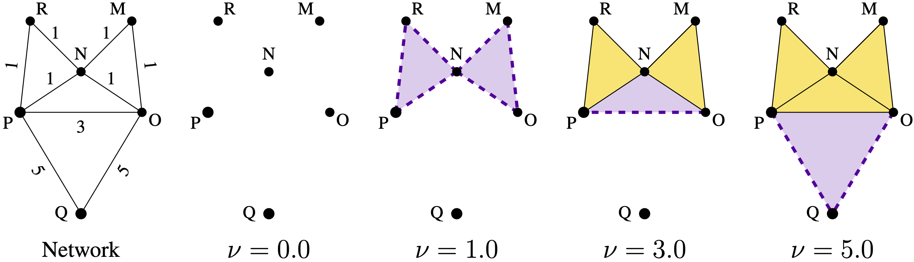

----------------------------------------------------------------------------
TAD: Topological Anomaly Detection in Dynamic Multilayer Blockchain Networks
----------------------------------------------------------------------------

*Figure: 3-clique complex and network filtration*

This package includes the source codes and datasets used in this research project. We encourage the reader to review the submitted paper: Topological Anomaly Detection in Dynamic Multilayer Blockchain Networks, and its Supplementary material.

The complete software list and requirements are included in the file "Requirements.txt".

Since our proposed methodology was tested on two different dynamic networks, Ethereum tokens and Ripple currencies, we include two folders in this package. Each folder contains 4 subfolders:
1) Codes: The full set of script files used in this research paper.
2) ReduceDataset: The reduced dynamic network used through this research.
3) PersistenceDiagrams: All persistence diagrams obtained via Clique Community Persistence.
4) Competitors: The competitor's source code used to contrast our methodology.

*Figure: Stacked persistence diagram (SPD) of a three layer network*

Next there is short description on each folder and file shared in this package.

--- Folder: Codes ---
* Codes must be executed in the same order of appearance

1) ReduceDataset.m
Given a dynamic network with thousands of nodes, this Matlab's code reduce network's size via maximum weight subgraph approximation.

2) Ethereum2Graphs.py/Ripple2Graphs.py
Given a dynamic network dataset, this Python's code creates daily graphs in edgeless format.

3) ETH_ExtraInfo.py/RIP_ExtraInfo.py
Using the information computed by ReducedDataset.m, this Python's code produces a concise summary of each layer. 

4) ETH_Graph2GDA.R/RIPPLE_Graph2GDA.R
Given graph-files in edgelist format, this R's code produces its corresponding Geodesic Densification.

5) ComputePD_KCCP_ETHEREUM.py/ComputePD_KCCP_RIPPLE.py
Using the clique community persistence implementation of Aleph library, see requirements.txt, this Python's code produces persistence diagram's files.

6) Unilayer_Ethereum.R/Unilayer_RIPPLE.R
This R code compute the anomaly detection on unilayer dynamic networks, using the files generated in previous steps. Also, see the submitted paper for further reading. (S-TAD)

7) Multilayer_Ethereum.R/Multilayer_RIPPLE.R
This R code compute the anomaly detection on multilayer dynamic networks, using the files generated in previous steps. Also, see the submitted paper for further reading. (TAD)

--- Folder: ReduceDataset ---
It contains the edgelist files of each layer's dynamic network, its corresponding reduced dataset and a concise summary of each layer.

--- Folder: PersistenceDiagrams ---
It contains the persist diagrams obtained via clique community persistence using the Aleph library https://pseudomanifold.github.io/Aleph/Rieck17d.html.

--- Folder: Competitors ---
Codes of competitors DC, gSeg, EMEu, EMKL. The codes were downloaded from original authors and adapted to be used in our dataset.

Codes must be executed in the same order of appearance in the aforementioned section "--- Folder: Codes ---".

##############
#=== Note ===#
##############

* Ground truth information is listed in "gt.txt".

